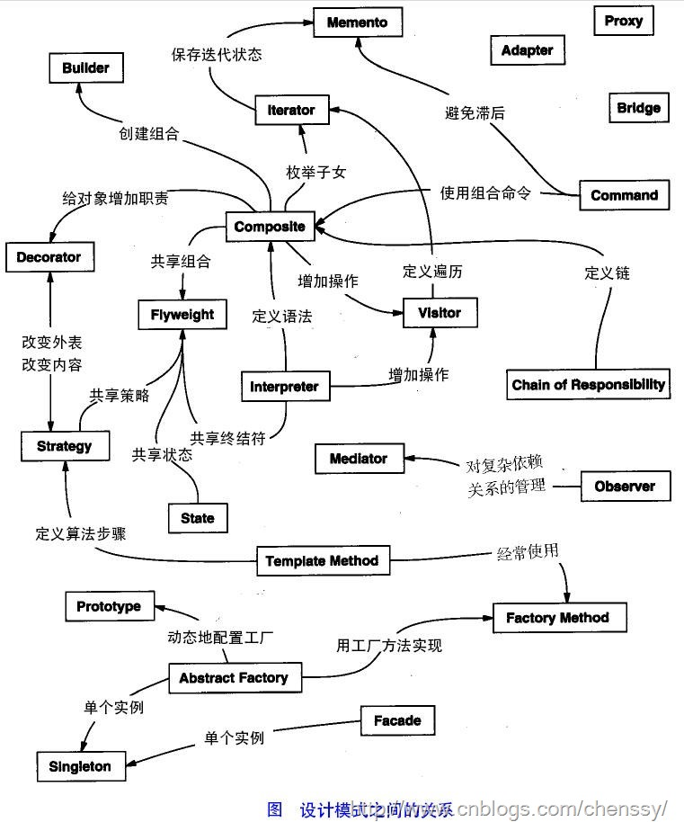

# 设计模式汇总

缺 grasp 设计模式相关的例子

复杂模型抽象：

- 纵看它是什么样的 template，横看它是什么样的 composite。
- 所有的 step 有没有什么办法抽象？结果和返回值怎么定义？
- 怎样保存中间状态？
- 怎么设计全局复用对象？
- 怎样管理状态？
- 怎样管理对对象的构造？
- 怎样动态地添加行为：proxy、decorator、strategy、bridge 和切面。